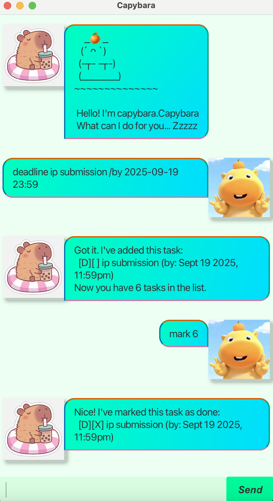

# Capybara User Guide  

Capybara is a friendly task management chatbot (very very very cute!) 🐹🍊.  
It helps you keep track of tasks, deadlines, and events — all from a simple chat interface.  

---

## Quick Start  

1. Ensure you have **Java 17 or later** installed.  
2. Download the latest `capybara.jar`.  
3. Run the application with:  
   ```bash
   java -jar Capybara.jar
   ```  
4. A GUI window will appear. Type your commands into the input box and press **Enter**.  

---

## Features  

### 1. Add a ToDo  
Format:  
```
todo <description>
```  
Alias: `t`  
Example:  
```
t read book
```  

---

### 2. Add a Deadline  
Format:  
```
deadline <description> /by yyyy-MM-dd HH:mm
```  
or, if only a date is given, it will default to midnight:  
```
deadline <description> /by yyyy-MM-dd
```  
Alias: `d`  
Example:  
```
d return book /by 2025-09-30 18:00
```  

---

### 3. Add an Event  
Format:  
```
event <description> /from yyyy-MM-dd HH:mm /to yyyy-MM-dd HH:mm
```  
Alias: `e`  
Example:  
```
e project meeting /from 2025-09-25 10:00 /to 2025-09-25 12:00
```  

---

### 4. List tasks  
Format:  
```
list
```  
Alias: `l`  
Shows all tasks currently stored.  

---

### 5. Mark/Unmark tasks  
Format:  
```
mark <task number>
unmark <task number>
```  
Aliases: `m`, `u`  
Example:  
```
m 2
```  
Marks task #2 as completed.  

---

### 6. Delete a task  
Format:  
```
delete <task number>
```  
Alias: `del`  
Example:  
```
del 3
```  

---

### 7. Find tasks by keyword  
Format:  
```
find <keyword>
```  
Example:  
```
find book
```  

---

### 8. Exit  
Format:  
```
bye
```  
Alias: `q`  
Closes the chatbot.  

---

## Error Handling  

Capybara handles errors gracefully:  
- If a command is unknown, you will see:  
  ```
  OOPS!!! I'm sorry, but I don't know what that means :-(
  ```  
- If a description is missing:  
  ```
  Peep! todo needs a description. Try: todo sleep ...
  ```  
- If a deadline or event is missing a date/time:  
  ```
  Sniff sniff… Your deadline needs a time! Try: deadline nap /by 2025-09-01
  ```  

---

## Saving and Loading  

- Tasks are **automatically saved** to `Data/taskStorage.txt`.  
- On restart, Capybara will load your saved tasks.  

---

## Example Session  

```
Hello! I'm Capybara 🐹🍊
What can I do for you?

t read book
Got it. I've added this task:
  [T][ ] read book
Now you have 1 task in the list.

d return book /by 2025-09-30 18:00
Got it. I've added this task:
  [D][ ] return book (by: Sep 30 2025, 6:00PM)
Now you have 2 tasks in the list.

list
Here are the tasks in your list:
  1.[T][ ] read book
  2.[D][ ] return book (by: Sep 30 2025, 6:00PM)

bye
Bye. Hope to see you again soon!
```

---

## Screenshot  

  
